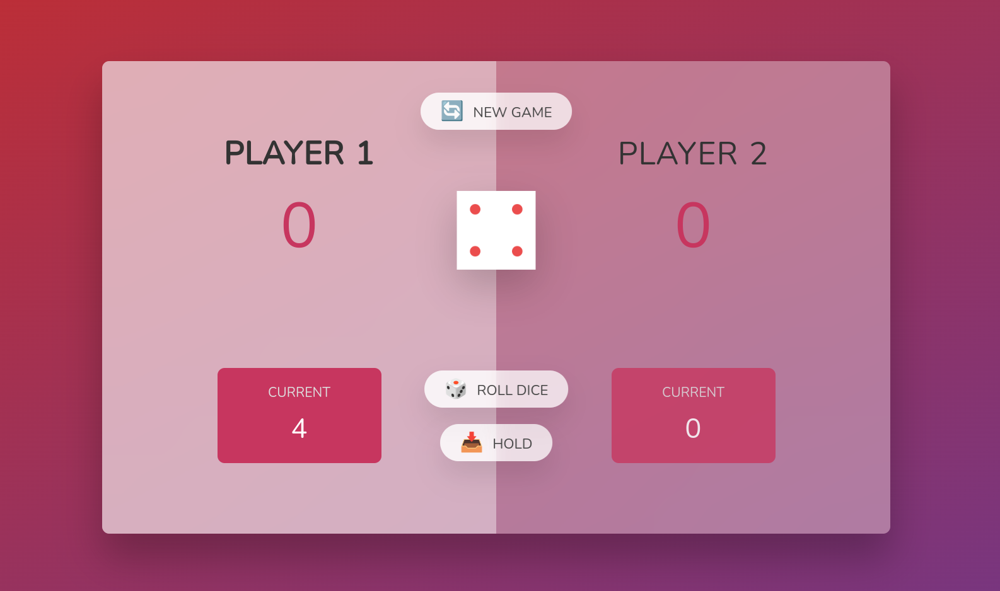

#Welcome to this simple dice game built with JavaScript!

 <strong>Here's how it works:</strong>
<ul>
<li>Two players take turns rolling a virtual dice.</li>
<li>Each roll adds the dice's value to the current Score</li>
<li>Dice rolling shift to another If the  player hold the current Score or a player get 1.</li>
<li>Random dice rolls for unpredictable excitement.</li>
<li>Score tracking for both players.</li>
<li>Winning condition based on reaching 50 points.</li>

</ul>